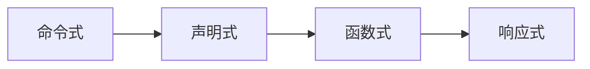

# 浅析 .NET 响应式编程 IObservable与ReactiveX

## 一、编程范式全景解读

### 1. 四大编程范式核心对比

| 范式             | 控制方式               | 数据流动             | 典型代表                  | 思维模式案例                |
|------------------|-----------------------|---------------------|-------------------------|---------------------------|
| **命令式编程**     | 明确的步骤指令          | 可变状态驱动         | C, Java循环结构          | 烹饪食谱：按步骤操作         |
| **声明式编程**     | 描述目标结果            | 自动推导执行路径     | SQL, LINQ, XAML          | 餐厅点餐：告知需求而非做法   |
| **函数式编程**     | 数学函数组合            | 不可变数据管道       | Haskell, F#, LINQ        | 流水线加工：输入→转换→输出   |
| **响应式编程**     | 事件流驱动              | 异步数据传播         | RxJS, ReactiveX          | 快递追踪：订阅状态变化通知   |

### 2. 范式演进趋势


```csharp
// 命令式 - 过程式操作
List<int> list = new List<int>();
for (int i = 0; i < 10; i++)
{
    if (i % 2 == 0) list.Add(i * 2);
}

// 声明式 - 描述结果
IEnumerable<int> result = Enumerable.Range(0, 10)
    .Where(x => x % 2 == 0)
    .Select(x => x * 2);

// 函数式 - 无副作用
int Transform(int x) => x * 2;
int final = Transform(Transform(5)); // 组合调用

// 响应式 - 事件流处理
Observable.Interval(TimeSpan.FromSeconds(1))
    .Subscribe(t => Console.WriteLine(t));
```


## 二、C#响应式编程核心：IObservable接口

### 1. 观察者模式双接口
```csharp
// 生产者接口
public interface IObservable<T> 
{
    IDisposable Subscribe(IObserver<T> observer);
}

// 消费者接口
public interface IObserver<T> 
{
    void OnNext(T value);    // 数据推送
    void OnError(Exception error);  // 错误处理
    void OnCompleted();      // 流终止
}
```

### 2. 完整实现案例：温度监控系统
```csharp
public class TemperatureSensor : IObservable<double>
{
    private List<IObserver<double>> _observers = new();

    public IDisposable Subscribe(IObserver<double> observer)
    {
        _observers.Add(observer);
        return new Unsubscriber(_observers, observer);
    }

    private class Unsubscriber : IDisposable
    {
        // 省略实现细节
    }

    public void RecordData(double temp)
    {
        // 模拟传感器故障
        if (temp > 100)
        {
            _observers.ForEach(o => o.OnError(
                new InvalidOperationException("传感器过热！")));
            return;
        }

        _observers.ForEach(o => o.OnNext(temp));
    }

    public void Shutdown()
    {
        _observers.ForEach(o => o.OnCompleted());
        _observers.Clear();
    }
}

// 观察者实现
public class AlertSystem : IObserver<double>
{
    public void OnNext(double temp)
    {
        Console.WriteLine($"当前温度：{temp}℃");
        if (temp > 35) Console.WriteLine("高温警告！");
    }

    public void OnError(Exception ex)
    {
        Console.WriteLine($"系统故障：{ex.Message}");
    }

    public void OnCompleted()
    {
        Console.WriteLine("监控系统已关闭");
    }
}
```

## 三、ReactiveX高级应用


### 1. 安装NuGet包
```bash
Install-Package System.Reactive
```

### 2. 核心操作符演示
```csharp
// 创建可观察序列
var mouseMoves = Observable.FromEventPattern<MouseEventArgs>(
    form, "MouseMove");

// 操作符链式处理
var throttledClicks = Observable.FromEventPattern(button, "Click")
    .Throttle(TimeSpan.FromMilliseconds(500))  // 防抖
    .Select(_ => DateTime.Now)                // 转换数据
    .Buffer(3)                                 // 聚合事件
    .Where(clicks => clicks.Count >= 3)       // 过滤条件
    .Subscribe(clicks => {
        Console.WriteLine($"3秒内快速点击{clicks.Count}次！");
    });
```

### 3. 实时数据管道
```csharp
// 模拟股票数据流
var stockTicker = Observable.Interval(TimeSpan.FromSeconds(1))
    .Select(_ => new {
        Symbol = "MSFT",
        Price = Random.Shared.Next(250, 270)
    });

// 构建处理管道
stockTicker
    .Where(quote => quote.Price > 260)
    .Buffer(TimeSpan.FromSeconds(5))
    .Subscribe(quotes => {
        var avg = quotes.Average(q => q.Price);
        Console.WriteLine($"5秒均价：{avg:F2}");
    });
```

## 四、参考
> 响应式编程不是银弹，但在处理事件流、实时数据等场景下，它能将复杂异步逻辑转化为清晰的声明式管道
   - [ReactiveX.io](http://reactivex.io/)
   - [IObservable<T> Interface](https://learn.microsoft.com/en-us/dotnet/api/system.iobservable-1?view=net-6.0)
