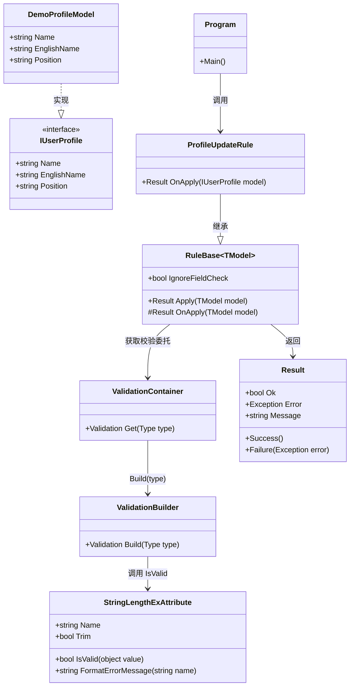

# 基于 Attribute 的 AOP 字段校验

## 写在前面

如何把字段校验从业务代码里抽离出来，做成一条可复用、可扩展、可缓存的“校验切面”。

适用场景：

- 业务模型字段很多，校验规则重复
- 想让校验逻辑统一收口，而不是散落在各个 Service
- 希望兼顾性能（表达式树编译 + 缓存）和可维护性（Attribute 声明式）

---

## 核心思路

核心链路可以概括为：

1. 在模型（接口）属性上声明 `ValidationAttribute`
2. 在规则基类 `RuleBase.Apply` 里统一触发字段校验
3. `ValidationContainer` 负责获取/缓存校验委托
4. `ValidationBuilder` 扫描属性特性并构建表达式树
5. 编译成 `Validation` 委托后执行，返回 `Result`

这本质上就是 AOP 思想：  
把“字段校验”作为横切关注点，从业务规则中切出来，通过统一入口织入。

---

## 类图



---

## 关键类职责

### RuleBase<TModel>

- 统一规则入口
- 在业务执行前触发字段校验
- 校验失败直接返回，校验通过再进入 `OnApply`

### ValidationContainer

- `ConcurrentDictionary<Type, Validation>` 缓存委托
- `GetOrAdd` 简化并发逻辑，避免重复构建

### ValidationBuilder

- 反射读取属性上的 `ValidationAttribute`
- 按规则拼装表达式树
- 编译为可复用委托，减少运行期开销

### StringLengthExAttribute

- 在 `StringLengthAttribute` 基础上增强
- 支持 `Trim`
- 支持中文错误文案
- 支持显式 token 替换，避免贪婪正则误匹配

---

## 每一步对应代码片段

[](https://imgchr.com/i/pe82Nex)

### 在接口属性上声明校验特性

```csharp
public interface IUserProfile
{
    [StringLengthEx("姓名", 10)]
    string Name { get; set; }

    [StringLengthEx("英文名", 8)]
    string EnglishName { get; set; }
}
```

### 在规则基类里统一触发校验

```csharp
public Result Apply(TModel model)
{
    if (!IgnoreFieldCheck)
    {
        if (model == null)
            return Result.Failure(new ArgumentNullException(nameof(model)));

        Validation func = ValidationContainer.Instance.Get(typeof(TModel));
        Result checkResult = func(model);
        if (!checkResult.Ok)
            return checkResult;
    }

    return OnApply(model);
}
```

### 容器中并发缓存委托

```csharp
private readonly ConcurrentDictionary<Type, Validation> _container =
    new ConcurrentDictionary<Type, Validation>();

public Validation Get(Type type)
{
    return _container.GetOrAdd(type, x => ValidationBuilder.Instance.Build(x));
}
```

### 通过表达式树构建校验委托

```csharp
public Validation Build(Type type)
{
    if (!type.IsCustomClassType())
        return _ => Result.Success();

    ParameterExpression modelExpr = Expression.Parameter(typeof(object), "model");
    ParameterExpression resultExpr = Expression.Variable(typeof(Result), "result");
    LabelTarget returnLabel = Expression.Label(typeof(Result));

    BlockExpression body = Expression.Block(
        new[] { resultExpr },
        BuildModelValidateExpr(type, modelExpr, returnLabel),
        Expression.Return(returnLabel, Expression.Call(typeof(Result), "Success", Type.EmptyTypes)),
        Expression.Label(returnLabel, resultExpr));

    return Expression.Lambda<Validation>(body, modelExpr).Compile();
}
```

表达式树构建后的代码
```csharp
Result result;
if (!StringLengthExAttribute.IsValid(((IUserProfile)model).Name))
{
    return Result.Failure(new FieldException("Name", "姓名长度不能超过10"));
}
if (!StringLengthExAttribute.IsValid(((IUserProfile)model).EnglishName))
{
    return Result.Failure(new FieldException("EnglishName", "英文名长度不能超过8"));
}
if (!StringLengthExAttribute.IsValid(((IUserProfile)model).Position))
{
    return Result.Failure(new FieldException("Position", "职位长度不能超过20"));
}

return Result.Success();
```


### 特性里执行具体规则

```csharp
public override bool IsValid(object value)
{
    if (Trim && value is string stringValue)
        value = stringValue.Trim();

    return base.IsValid(value);
}
```

### 错误模板用显式 token 替换

```csharp
private static readonly Regex TokenRegex =
    new Regex(@"\{([A-Za-z_][A-Za-z0-9_]*)\}", RegexOptions.Compiled);

string message = TokenRegex.Replace(attr.ErrorMessage, match =>
{
    string token = match.Groups[1].Value;
    if (dict.TryGetValue(token, out object tokenValue))
        return Convert.ToString(tokenValue);

    return match.Value;
});
```

---

## 完整代码

[在线运行地址](https://dotnetfiddle.net/Sd8cwJ)

```csharp
using System;
using System.Collections;
using System.Collections.Concurrent;
using System.Collections.Generic;
using System.ComponentModel.DataAnnotations;
using System.Linq;
using System.Linq.Expressions;
using System.Reflection;
using System.Text.RegularExpressions;

namespace ValidationDemo
{
    /// <summary>
    /// 入口
    /// </summary>
    /// <remarks>
    /// 演示规则触发、Attribute 校验和统一结果返回这条链路
    /// </remarks>
    public static class Program
    {
        public static void Main()
        {
            ProfileUpdateRule rule = new ProfileUpdateRule(); // 规则对象：负责触发字段校验

            DemoProfileModel successModel = new DemoProfileModel
            {
                Name = "  张三  ", // 前后空格会在特性中 Trim 后校验
                EnglishName = "Tom", // 合法长度
                Position = "Engineer" // 合法长度
            };

            Result success = rule.Apply(successModel); // 走 RuleBase.Apply -> ValidationContainer -> ValidationBuilder
            Console.WriteLine($"Success Case => Ok:{success.Ok}, Message:{success.Message}");

            DemoProfileModel failedModel = new DemoProfileModel
            {
                Name = "  这是一个超长姓名这是一个超长姓名  ", // 超出 Name 最大长度 10
                EnglishName = "ThisEnglishNameIsTooLong", // 该字段也超长，但会被 Name 先拦截（当前实现失败即返回）
                Position = "Senior Engineer" // 不会执行到此字段校验
            };

            Result failed = rule.Apply(failedModel); // 预期失败并返回 FieldException
            Console.WriteLine($"Failed Case => Ok:{failed.Ok}, Message:{failed.Message}");
            if (failed.Error != null)
                Console.WriteLine($"Failed Error Type => {failed.Error.GetType().FullName}");

            Console.WriteLine("Done.");
        }
    }

    /// <summary>
    /// 扩展版长度特性
    /// </summary>
    [AttributeUsage(AttributeTargets.Property | AttributeTargets.Parameter, AllowMultiple = false)]
    public class StringLengthExAttribute : StringLengthAttribute
    {
        /// <summary>
        /// 字段显示名
        /// </summary>
        public string Name { get; }

        /// <summary>
        /// 是否先 Trim
        /// </summary>
        public bool Trim { get; set; } = true;

        /// <summary>
        /// 初始化特性
        /// </summary>
        public StringLengthExAttribute(string name, int maximumLength)
            : base(maximumLength)
        {
            Name = name;
        }

        /// <summary>
        /// 执行校验
        /// </summary>
        public override bool IsValid(object value)
        {
            if (Trim)
            {
                if (value is string stringValue)
                    value = stringValue.Trim();
            }

            return base.IsValid(value);
        }

        /// <summary>
        /// 格式化错误消息
        /// </summary>
        /// <remarks>
        /// 如果没有显式配置 ErrorMessage，就使用默认中文模板
        /// </remarks>
        public override string FormatErrorMessage(string name)
        {
            if (string.IsNullOrWhiteSpace(ErrorMessage))
            {
                ErrorMessage = MinimumLength == 0
                    ? $"{Name}长度不能超过{{1}}"
                    : $"{Name}长度不能少于{{2}}或超过{{1}}";
            }

            return base.FormatErrorMessage(name);
        }
    }

    /// <summary>
    /// 字段校验异常
    /// </summary>
    public class FieldException : Exception
    {
        /// <summary>
        /// 失败字段名
        /// </summary>
        public string Field { get; private set; }

        public FieldException(string field, string message)
            : base(message)
        {
            Field = field;
        }

        public FieldException() : base()
        {
        }

        public FieldException(string message) : base(message)
        {
        }

        public FieldException(string message, Exception innerException) : base(message, innerException)
        {
        }
    }

    /// <summary>
    /// 统一返回结果
    /// </summary>
    public class Result
    {
        /// <summary>
        /// 是否成功
        /// </summary>
        public bool Ok { get; private set; }

        /// <summary>
        /// 错误对象
        /// </summary>
        public Exception Error { get; private set; }

        /// <summary>
        /// 可读消息
        /// </summary>
        public string Message { get; private set; }

        /// <summary>
        /// 创建成功结果
        /// </summary>
        public static Result Success()
        {
            return new Result
            {
                Ok = true,
                Message = "OK"
            };
        }

        /// <summary>
        /// 创建失败结果
        /// </summary>
        public static Result Failure(Exception error)
        {
            return new Result
            {
                Ok = false,
                Error = error,
                Message = error?.Message
            };
        }
    }

    /// <summary>
    /// 验证委托
    /// </summary>
    public delegate Result Validation(object model);

    /// <summary>
    /// 字段校验入口
    /// </summary>
    public static class FieldCheckHelper
    {
        /// <summary>
        /// 执行字段校验
        /// </summary>
        /// <remarks>
        /// 按运行时类型取缓存委托并执行
        /// </remarks>
        public static Result CheckFields(object model)
        {
            Validation func = ValidationContainer.Instance.Get(model.GetType());
            return func(model);
        }
    }

    /// <summary>
    /// 校验委托容器
    /// </summary>
    /// <remarks>
    /// 按类型缓存委托，首次构建，后续复用
    /// </remarks>
    public class ValidationContainer
    {
        private readonly ConcurrentDictionary<Type, Validation> _container = new ConcurrentDictionary<Type, Validation>();

        public static ValidationContainer Instance { get; } = new ValidationContainer();

        /// <summary>
        /// 获取校验委托
        /// </summary>
        public Validation Get(Type type)
        {
            return _container.GetOrAdd(type, x => ValidationBuilder.Instance.Build(x));
        }
    }

    /// <summary>
    /// 校验表达式构建器
    /// </summary>
    /// <remarks>
    /// 扫描属性上的 ValidationAttribute，拼表达式树并编译成委托
    /// </remarks>
    public class ValidationBuilder
    {
        private static readonly Regex TokenRegex = new Regex(@"\{([A-Za-z_][A-Za-z0-9_]*)\}", RegexOptions.Compiled);

        public static ValidationBuilder Instance { get; } = new ValidationBuilder();

        /// <summary>
        /// 构建校验委托
        /// </summary>
        public Validation Build(Type type)
        {
            if (!type.IsCustomClassType())
                return _ => Result.Success(); // 非对象类型直接放行

            ParameterExpression modelExpr = Expression.Parameter(typeof(object), "model");
            ParameterExpression resultExpr = Expression.Variable(typeof(Result), "result");
            LabelTarget returnLabel = Expression.Label(typeof(Result));
            BlockExpression body = Expression.Block(
                new[] { resultExpr },
                BuildModelValidateExpr(type, modelExpr, returnLabel),
                Expression.Return(returnLabel, Expression.Call(typeof(Result), "Success", Type.EmptyTypes)),
                Expression.Label(returnLabel, resultExpr));

            return Expression.Lambda<Validation>(body, modelExpr).Compile();
        }

        /// <summary>
        /// 生成模型校验表达式
        /// </summary>
        /// <remarks>
        /// 类只校验自身属性；接口会把继承链上的接口属性一并校验
        /// </remarks>
        private Expression BuildModelValidateExpr(Type type, Expression modelExpr, LabelTarget returnLabel)
        {
            Expression validateExpr = BuildSimpleModelValidateExpr(type, modelExpr, returnLabel);
            if (!type.IsInterface)
                return validateExpr;

            IEnumerable<Type> interfaces = type.GetInterfaces();
            IEnumerable<Expression> expressions = interfaces.Select(x => BuildSimpleModelValidateExpr(x, modelExpr, returnLabel));

            return Expression.Block(expressions.Concat(new Expression[] { validateExpr }));
        }

        /// <summary>
        /// 生成类型属性校验表达式
        /// </summary>
        private Expression BuildSimpleModelValidateExpr(Type type, Expression modelExpr, LabelTarget returnLabel)
        {
            PropertyInfo[] properties = type.GetProperties(BindingFlags.Instance | BindingFlags.Public);
            if (properties.Length == 0)
                return Expression.Empty();

            IEnumerable<Expression> expressions = properties.Select(property =>
            {
                Attribute[] attrs = Attribute.GetCustomAttributes(property, typeof(ValidationAttribute), true);
                MemberExpression propertyExpr = Expression.Property(Expression.Convert(modelExpr, type), property.Name);

                return BuildPropValidateExpr(attrs, property, propertyExpr, returnLabel);
            });

            return Expression.Block(expressions);
        }

        /// <summary>
        /// 生成属性校验表达式
        /// </summary>
        /// <remarks>
        /// 把一个属性上的多个 ValidationAttribute 依次拼成表达式
        /// </remarks>
        private Expression BuildPropValidateExpr(Attribute[] attrs, PropertyInfo property, Expression propertyExpr, LabelTarget returnLabel)
        {
            if (attrs == null || attrs.Length == 0)
                return Expression.Empty();

            IEnumerable<Expression> expressions = attrs.Select(attr =>
            {
                ValidationAttribute validationAttr = attr as ValidationAttribute;
                Expression isValidExpr = Expression.Call(
                    Expression.Constant(validationAttr),
                    "IsValid",
                    Type.EmptyTypes,
                    Expression.Convert(propertyExpr, typeof(object)));

                // 校验失败时立即 Return
                return Expression.IfThen(
                    Expression.IsFalse(isValidExpr),
                    Expression.Return(
                        returnLabel,
                        Expression.Call(
                            typeof(Result),
                            "Failure",
                            Type.EmptyTypes,
                            Expression.New(
                                typeof(FieldException).GetConstructor(new Type[] { typeof(string), typeof(string) }),
                                Expression.Constant(property.Name),
                                BuildErrorMsgExpr(validationAttr, property)))));
            });

            return Expression.Block(expressions);
        }

        /// <summary>
        /// 构造错误消息
        /// </summary>
        /// <remarks>
        /// 优先用默认格式化文案；若配置了模板则做占位符替换
        /// </remarks>
        private Expression BuildErrorMsgExpr(ValidationAttribute attr, PropertyInfo property)
        {
            if (string.IsNullOrWhiteSpace(attr.ErrorMessage))
                return Expression.Constant(attr.FormatErrorMessage(property.Name));

            Dictionary<string, object> dict = attr.GetType()
                .GetProperties(BindingFlags.Instance | BindingFlags.Public)
                .ToDictionary(x => x.Name, x => x.GetValue(attr), StringComparer.OrdinalIgnoreCase);

            string message = TokenRegex.Replace(attr.ErrorMessage, match =>
            {
                string token = match.Groups[1].Value;
                if (dict.TryGetValue(token, out object tokenValue))
                    return Convert.ToString(tokenValue);

                return match.Value;
            });

            return Expression.Constant(message);
        }
    }

    /// <summary>
    /// 类型扩展
    /// </summary>
    public static class TypeExtensions
    {
        /// <summary>
        /// 判断是否可做对象校验
        /// </summary>
        /// <remarks>
        /// 支持类和接口，排除 string
        /// </remarks>
        public static bool IsCustomClassType(this Type type)
        {
            return type != null
                && (type.IsClass || type.IsInterface)
                && type != typeof(string);
        }

        /// <summary>
        /// 判断是否可枚举类型
        /// </summary>
        /// <remarks>
        /// 当前 demo 未使用，预留给集合校验场景
        /// </remarks>
        public static bool IsEnumerableType(this Type type)
        {
            if (type == null || type == typeof(string))
                return false;

            return typeof(IEnumerable).IsAssignableFrom(type);
        }
    }

    /// <summary>
    /// 规则基类
    /// </summary>
    /// <remarks>
    /// 在 Apply 里先做字段校验，校验通过后再执行具体业务
    /// </remarks>
    public abstract class RuleBase<TModel>
    {
        /// <summary>
        /// 是否跳过字段校验
        /// </summary>
        public bool IgnoreFieldCheck { get; set; }

        protected RuleBase(bool ignoreFieldCheck = false)
        {
            IgnoreFieldCheck = ignoreFieldCheck;
        }

        /// <summary>
        /// 执行规则
        /// </summary>
        public Result Apply(TModel model)
        {
            if (!IgnoreFieldCheck)
            {
                if (model == null)
                    return Result.Failure(new ArgumentNullException(nameof(model))); // 空模型直接失败

                Validation func = ValidationContainer.Instance.Get(typeof(TModel)); // 按声明模型类型获取委托（与主工程一致）
                Result checkResult = func(model);
                if (!checkResult.Ok)
                    return checkResult; // 字段校验失败：不中断返回业务层，直接退出
            }

            return OnApply(model);
        }

        /// <summary>
        /// 业务扩展点
        /// </summary>
        protected abstract Result OnApply(TModel model);
    }

    /// <summary>
    /// 接口模型
    /// </summary>
    public interface IUserProfile
    {
        [StringLengthEx("姓名", 10)]
        string Name { get; set; }

        [StringLengthEx("英文名", 8)]
        string EnglishName { get; set; }

        [StringLengthEx("职位", 20)]
        string Position { get; set; }
    }

    /// <summary>
    /// 实现模型
    /// </summary>
    public class DemoProfileModel : IUserProfile
    {
        public string Name { get; set; }

        public string EnglishName { get; set; }

        public string Position { get; set; }
    }

    /// <summary>
    /// 更新规则示例
    /// </summary>
    /// <remarks>
    /// 继承 RuleBase 后，字段校验会在 Apply 里自动执行
    /// </remarks>
    public class ProfileUpdateRule : RuleBase<IUserProfile>
    {
        protected override Result OnApply(IUserProfile model)
        {
            return Result.Success(); // demo 中业务处理省略
        }
    }
}
```