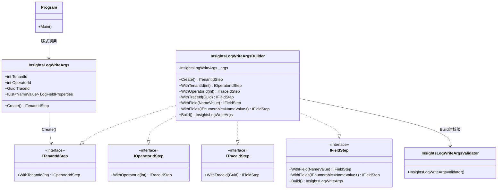

## 前言

在业务日志上报场景里，入参通常有“必填且有顺序”的要求：必须先给 `TenantId`，再给 `OperatorId`，再给 `TraceId`，最后补充动态字段并 `Build()`。  
如果调用顺序错了，运行时才报错会比较晚；如果能在编译期就约束顺序，体验会更好。

- 核心目标：
  - 用构建者模式（准确说是 Step Builder）保证属性初始化顺序
  - 用 FluentValidation 做最终一致性校验（`Build()` 时兜底）

---

## 核心思路

整体链路：

1. 调用 `InsightsLogWriteArgs.Create()`，返回第一步接口 `ITenantIdStep`
2. 每一步 `WithXxx` 返回“下一步接口”，把可调用方法收窄，形成顺序约束
3. 最后进入 `IFieldStep.Build()`，统一执行 FluentValidation `ValidateAndThrow`
4. 校验通过返回 `InsightsLogWriteArgs`，进入后续写日志流程

对应实现位置：

- `Create()` 入口：`InsightsLogWriteArgs.cs`
- Step 接口 + Builder：`InsightsLogWriteArgs.Builder.cs`
- FluentValidation 规则：`InsightsLogWriteArgs.Validator.cs`

### 类图调用关系



---

## 关键类职责

- `InsightsLogWriteArgs`
  - 纯数据模型，承载最终日志入参
  - 暴露 `Create()` 作为构建入口

- `ITenantIdStep / IOperatorIdStep / ITraceIdStep / IFieldStep`
  - “步骤接口”是顺序约束核心
  - 前一步只暴露下一步，阻止乱序调用

- `InsightsLogWriteArgsBuilder`
  - 负责逐步写入 `_args`
  - `Build()` 触发 FluentValidation，一次性兜底

- `InsightsLogWriteArgsValidator`
  - 声明规则：
    - `TenantId > 0`
    - `OperatorId > 0`
    - `TraceId != Guid.Empty`
    - `LogFieldProperties` 非空且至少一个元素

- `InsightsLogWriteArgsBuilderTests`
  - 验证“正确链路可通过”
  - 验证“错误输入会抛 ValidationException”

---

## 代码片段

### 从测试进入链式构建

```csharp
SDK.Args.InsightsLog.InsightsLogWriteArgs res = SDK.Args.InsightsLog.InsightsLogWriteArgs.Create()
    .WithTenantId(100002) // 第1步：先设置租户
    .WithOperatorId(10000) // 第2步：再设置操作人
    .WithTraceId(Guid.NewGuid()) // 第3步：设置链路追踪ID
    .WithField(new SDK.Args.InsightsLog.InsightsLogWriteArgs.NameValue(InsightsLogConst.BUTTONNAME_KEY, "来源动作")) // 追加单个业务字段
    .WithFields(new List<SDK.Args.InsightsLog.InsightsLogWriteArgs.NameValue>
    {
        new SDK.Args.InsightsLog.InsightsLogWriteArgs.NameValue(InsightsLogConst.BUTTONCODE_KEY, "来源动作编码") // 追加批量字段
    }).Build(); // 最后统一校验并生成对象
```

### Create 交给 Builder（但返回第一步接口）

```csharp
public static ITenantIdStep Create()
{
    return InsightsLogWriteArgsBuilder.Create(); // 只暴露第一步接口，限制调用入口
}
```

### Step Interface 保证顺序

```csharp
public interface ITenantIdStep
{
    IOperatorIdStep WithTenantId(int tenantId); // 只能流转到 OperatorId 步骤
}

public interface IOperatorIdStep
{
    ITraceIdStep WithOperatorId(int operatorId); // 只能流转到 TraceId 步骤
}

public interface ITraceIdStep
{
    IFieldStep WithTraceId(Guid traceId); // 进入字段收集与 Build 阶段
}
```

### Build 阶段统一触发 FluentValidation

```csharp
public InsightsLogWriteArgs Build()
{
    InsightsLogWriteArgsValidator res = new InsightsLogWriteArgsValidator(); // 创建验证器
    res.ValidateAndThrow(_args); // 失败直接抛 ValidationException

    return _args; // 成功返回构建结果
}
```

### FluentValidation 规则声明

```csharp
RuleFor(x => x.TenantId).GreaterThan(0).WithMessage("租户ID必须大于0"); // 基础ID必须为正
RuleFor(x => x.OperatorId).GreaterThan(0).WithMessage("操作人ID必须大于0"); // 基础ID必须为正
RuleFor(x => x.TraceId).NotEqual(Guid.Empty).WithMessage("TraceID不能是空GUID"); // 禁止空链路ID

RuleFor(x => x.LogFieldProperties)
    .NotNull() // 集合不能为空
    .WithMessage("日志字段映射不能为NULL")
    .Must(dict => dict?.Any() == true) // 集合至少包含1个字段
    .WithMessage("日志字段映射必须包含一个元素");
```

---

## 完整代码

[在线运行地址](https://dotnetfiddle.net/BI1MuD)

```csharp
namespace Demo.InsightsLog
{
    using FluentValidation;
    using System;
    using System.Collections.Generic;
    using System.Linq;

    internal static class Program
    {
        private static void Main(string[] args)
        {
            // Arrange & Act
            InsightsLogWriteArgs res = InsightsLog.InsightsLogWriteArgs.Create()
                .WithTenantId(100002) // 使用有效的租户ID
                .WithOperatorId(10000) // 使用有效的操作人ID
                .WithTraceId(Guid.NewGuid()) // 的TraceId
                .WithField(new InsightsLogWriteArgs.NameValue("ACTION_LABEL", "来源动作")) // 添加单个字段
                .WithFields(new List<InsightsLogWriteArgs.NameValue>() // 或者直接添加多个字段
                {
                    new InsightsLogWriteArgs.NameValue("ACTION_NAME", "来源动作编码" ),
                    new InsightsLogWriteArgs.NameValue("PAGE_LABEL", "来源页面" ),
                    new InsightsLogWriteArgs.NameValue("PAGE_NAME", "来源页面编码" ),
                    new InsightsLogWriteArgs.NameValue("VERSION", "前端版本" ),
                    new InsightsLogWriteArgs.NameValue("USER_AGENT", "终端内核" ),
                    new InsightsLogWriteArgs.NameValue("IP", "IP地址" ),
                }).Build();

            // Assert
            IsNotNull(res, nameof(res)); // 控制台断言：对象不能为空
            AreEqual(100002, res.TenantId, nameof(res.TenantId));
            AreEqual(10000, res.OperatorId, nameof(res.OperatorId));
            IsTrue(res.TraceId != Guid.Empty, nameof(res.TraceId));
            AreEqual(7, res.LogFieldProperties.Count, nameof(res.LogFieldProperties));
            IsTrue(res.LogFieldProperties.Any(x => x.Name == "ACTION_LABEL" && x.Value == "来源动作"), "ACTION_LABEL");
            IsTrue(res.LogFieldProperties.Any(x => x.Name == "ACTION_NAME" && x.Value == "来源动作编码"), "ACTION_NAME");
            IsTrue(res.LogFieldProperties.Any(x => x.Name == "PAGE_LABEL" && x.Value == "来源页面"), "PAGE_LABEL");
            IsTrue(res.LogFieldProperties.Any(x => x.Name == "PAGE_NAME" && x.Value == "来源页面编码"), "PAGE_NAME");
            IsTrue(res.LogFieldProperties.Any(x => x.Name == "VERSION" && x.Value == "前端版本"), "VERSION");
            IsTrue(res.LogFieldProperties.Any(x => x.Name == "USER_AGENT" && x.Value == "终端内核"), "USER_AGENT");
            IsTrue(res.LogFieldProperties.Any(x => x.Name == "IP" && x.Value == "IP地址"), "IP");

            Console.WriteLine("All assertions passed."); // 控制台输出：断言全部通过
        }

        private static void IsNotNull(object value, string name)
        {
            if (value == null)
                throw new InvalidOperationException($"{name} should not be null.");
        }

        private static void IsTrue(bool condition, string name)
        {
            if (!condition)
                throw new InvalidOperationException($"{name} should be true.");
        }

        private static void AreEqual<T>(T expected, T actual, string name)
        {
            if (!Equals(expected, actual))
                throw new InvalidOperationException($"{name} expected: {expected}, actual: {actual}.");
        }
    }

    public sealed class OperateResult<T>
    {
        public bool Ok { get; private set; } // 调用是否成功

        public T Content { get; private set; } // 成功结果内容

        public string Error { get; private set; } // 失败错误信息

        public static OperateResult<T> Success(T content)
        {
            OperateResult<T> result = new OperateResult<T>
            {
                Ok = true,
                Content = content,
                Error = string.Empty
            };

            return result;
        }
    }

    public sealed class InsightsLogWriteResult
    {
        public InsightsLogWriteResult(long offset)
        {
            Offset = offset; // 消息偏移量
        }

        public long Offset { get; private set; } // Kafka offset
    }

    public sealed class InsightsLogWriteArgs
    {
        public static ITenantIdStep Create()
        {
            return InsightsLogWriteArgsBuilder.Create(); // 统一从 Step Builder 进入
        }

        public int TenantId { get; set; } // 租户ID

        public int OperatorId { get; set; } // 操作人ID

        public Guid TraceId { get; set; } // 链路追踪ID

        public IList<NameValue> LogFieldProperties { get; set; } = new List<NameValue>(); // 动态字段集合

        public sealed class NameValue
        {
            public NameValue()
            {
            }

            public NameValue(string name, string value)
            {
                Name = name; // 字段名
                Value = value; // 字段值
            }

            public string Name { get; set; }

            public string Value { get; set; }
        }
    }

    public interface ITenantIdStep
    {
        IOperatorIdStep WithTenantId(int tenantId); // 第一步：设置 TenantId 后进入第二步
    }

    public interface IOperatorIdStep
    {
        ITraceIdStep WithOperatorId(int operatorId); // 第二步：设置 OperatorId 后进入第三步
    }

    public interface ITraceIdStep
    {
        IFieldStep WithTraceId(Guid traceId); // 第三步：设置 TraceId 后进入字段阶段
    }

    public interface IFieldStep
    {
        IFieldStep WithField(InsightsLogWriteArgs.NameValue item); // 支持链式追加单个字段

        IFieldStep WithFields(IEnumerable<InsightsLogWriteArgs.NameValue> fields); // 支持链式追加多个字段

        InsightsLogWriteArgs Build(); // 触发最终校验并返回结果
    }

    public sealed class InsightsLogWriteArgsBuilder : ITenantIdStep, IOperatorIdStep, ITraceIdStep, IFieldStep
    {
        private readonly InsightsLogWriteArgs _args = new InsightsLogWriteArgs();

        private InsightsLogWriteArgsBuilder()
        {
        }

        public static ITenantIdStep Create()
        {
            return new InsightsLogWriteArgsBuilder(); // Builder 对外仅暴露第一步
        }

        public IOperatorIdStep WithTenantId(int tenantId)
        {
            _args.TenantId = tenantId; // 写入租户ID
            return this;
        }

        public ITraceIdStep WithOperatorId(int operatorId)
        {
            _args.OperatorId = operatorId; // 写入操作人ID
            return this;
        }

        public IFieldStep WithTraceId(Guid traceId)
        {
            _args.TraceId = traceId; // 写入TraceId
            return this;
        }

        public IFieldStep WithField(InsightsLogWriteArgs.NameValue item)
        {
            _args.LogFieldProperties.Add(item); // 追加单个字段
            return this;
        }

        public IFieldStep WithFields(IEnumerable<InsightsLogWriteArgs.NameValue> fields)
        {
            foreach (InsightsLogWriteArgs.NameValue item in fields)
            {
                _args.LogFieldProperties.Add(item); // 逐个追加字段
            }

            return this;
        }

        public InsightsLogWriteArgs Build()
        {
            InsightsLogWriteArgsValidator validator = new InsightsLogWriteArgsValidator(); // 构造验证器
            validator.ValidateAndThrow(_args); // 不合法直接抛出异常

            return _args; // 返回最终对象
        }
    }

    public sealed class InsightsLogWriteArgsValidator : AbstractqValidator<InsightsLogWriteArgs>
    {
        public InsightsLogWriteArgsValidator()
        {
            RuleFor(x => x.TenantId).GreaterThan(0).WithMessage("租户ID必须大于0"); // 规则1：TenantId 必须大于0
            RuleFor(x => x.OperatorId).GreaterThan(0).WithMessage("操作人ID必须大于0"); // 规则2：OperatorId 必须大于0
            RuleFor(x => x.TraceId).NotEqual(Guid.Empty).WithMessage("TraceID不能是空GUID"); // 规则3：TraceId 不能为默认值
            RuleFor(x => x.LogFieldProperties)
                .NotNull() // 规则4：字段集合不能为 null
                .WithMessage("日志字段映射不能为NULL")
                .Must(dict => dict?.Any() == true) // 规则5：字段集合至少 1 条
                .WithMessage("日志字段映射必须包含一个元素");
        }
    }
}
```
