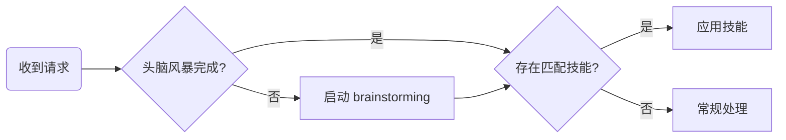

# Superpowers：让 Claude Code 成为你的资深开发搭档

## 什么是 Superpowers

Superpowers 不是简单的提示词模板，而是一套有纪律、可验证、可追溯的开发方法论。


```text

superpowers/
├── skills/           ← 14 个核心 Skills（带 references/ 按需加载）
├── agents/           ← 子智能体（code-reviewer）
├── commands/         ← 3 个命令（/brainstorm /write-plan /execute-plan）
├── hooks/            ← 会话钩子（启动时自动注入）
├── .claude-plugin/   ← Claude Code 插件配置
├── .codex/           ← Codex 适配
├── .opencode/        ← OpenCode 适配
├── GEMINI.md         ← Gemini CLI 适配
└── docs/

```

## 核心理念

Superpowers 的设计哲学可以用三句话概括：

1. **先思考，再动手** — 任何功能开发前必须经过头脑风暴和设计评审
2. **先测试，再编码** — TDD 不是建议，是铁律
3. **先验证，再声称** — 没有运行过测试，就不能说"搞定了"

## 技能一览

### 技能


| 技能 | 触发时机 | 作用 |
|------|----------|------|
| **using-superpowers** | 每次对话开始 | 引导检查是否有适用的技能，建立技能发现流程 |

### 设计阶段

| 技能 | 触发时机 | 作用 |
|------|----------|------|
| **brainstorming** | 创建功能、构建组件、修改行为前 | 结构化协作对话：探索上下文 → 逐个澄清问题 → 提出 2-3 种方案及权衡 → 设计评审 → 输出设计文档 |
| **writing-plans** | 有设计文档或需求后 | 将设计转化为细粒度实施计划，每步 2-5 分钟，包含精确文件路径、完整代码块、预期输出 |

### 执行阶段

| 技能 | 触发时机 | 作用 |
|------|----------|------|
| **using-git-worktrees** | 开始功能开发前 | 创建隔离工作空间，避免污染主分支 |
| **subagent-driven-development** | 执行实施计划时（推荐） | 每个任务派发独立子代理，执行后双重审查（规格合规 + 代码质量） |
| **executing-plans** | 执行实施计划时（简单版） | 在当前会话中逐任务执行计划，遇到阻塞时停下来请求帮助 |
| **test-driven-development** | 编写任何功能或修复前 | 强制 Red-Green-Refactor 循环：先写失败测试 → 写最少代码通过 → 重构 |
| **dispatching-parallel-agents** | 有 2+ 个独立任务时 | 为每个独立问题域派发一个代理并行工作 |

### 质量保障

| 技能 | 触发时机 | 作用 |
|------|----------|------|
| **systematic-debugging** | 遇到 bug、测试失败、意外行为时 | 四阶段调试：根因调查 → 模式分析 → 假设验证 → 实施修复。铁律：不查清根因不动手修 |
| **verification-before-completion** | 即将声称工作完成时 | 运行验证命令并确认输出后才能说"完成"。禁止使用"应该"、"可能"、"看起来" |
| **requesting-code-review** | 完成任务、大功能、合并前 | 派发代码审查子代理，分级处理反馈：Critical 立即修、Important 继续前修、Minor 记录 |
| **receiving-code-review** | 收到代码审查反馈时 | 用技术严谨性回应，禁止表演式附和（"你说得对！"），要求用技术论据说话 |

### 收尾阶段

| 技能 | 触发时机 | 作用 |
|------|----------|------|
| **finishing-a-development-branch** | 所有测试通过后 | 提供 4 个结构化选项：本地合并、推送并创建 PR、保持现状、丢弃 |
| **writing-skills** | 发现可复用的技术模式时 | 用 TDD 原则创建新技能：先跑失败场景 → 写最小技能 → 堵住漏洞 |

## 标准工作流

一个完整的功能开发流程如下：


```
1. brainstorming          ← 头脑风暴，输出设计文档
       ↓
2. writing-plans          ← 将设计转化为实施计划
       ↓
3. using-git-worktrees    ← 创建隔离工作空间
       ↓
4. subagent-driven-dev    ← 逐任务执行（推荐路径）
   ├── test-driven-dev    ← 每个任务内部强制 TDD
   ├── requesting-review  ← 每个任务完成后审查
   └── dispatching-parallel ← 独立任务并行处理
       ↓
5. verification           ← 全部完成后验证
       ↓
6. finishing-branch       ← 合并 / PR / 清理
```

编程框架用自然语言描述流程，但自然语言天然是模糊的。Superpowers 用 DOT 语法定义决策流程图，每个节点代表一个状态，每条边代表一个转移条件。

比如 using-superpowers 技能中的路由流程图

DOT 语法非常灵活，我们完全可以根据你的实际业务逻辑来修改、扩展甚至重写这个流程图

```text
digraph superpowers_router {
    start [label="收到用户请求"]
    check_brainstorm [label="已经做过头脑风暴？" shape=diamond]
    brainstorm [label="启动 brainstorming 技能"]
    check_skills [label="有适用的技能？" shape=diamond]
    apply_skill [label="应用对应技能"]
    proceed [label="正常处理请求"]

    start -> check_brainstorm
    check_brainstorm -> brainstorm [label="否"]
    check_brainstorm -> check_skills [label="是"]
    brainstorm -> check_skills
    check_skills -> apply_skill [label="是"]
    check_skills -> proceed [label="否"]
}
```



## 实际使用示例

### 场景 1：开发新功能


```
你：我需要开发个CLI工具，支持停用、启用产品，并记录日志到租户下

Claude（自动触发 brainstorming）：
  → 先探索项目上下文
  → 逐个问你澄清问题（参数格式？日志格式？数据如何持久化？）
  → 提出 2-3 种方案及各自权衡
  → 你选择方案后输出设计文档
  → 自动转入 writing-plans 生成实施计划
  → 你选择执行方式后开始编码
```

### 场景 2：调试一个诡异的 bug


```
你：有个BUG需要解决 https://jira.beisen-inc.com/browse/ACCOUT-15981
Claude（自动触发 systematic-debugging）：
  → Phase 1：读错误代码、复现问题、检查最近变更
  → Phase 2：找到正常工作的发起流程，对比差异
  → Phase 3：提出假设并验证（比如：参数错误？）
  → Phase 4：写失败测试 → 修复 → 验证
```


