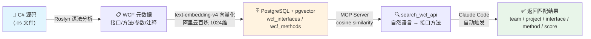

# WCF API 语义搜索工具

基于向量语义搜索的 WCF ServiceContract 接口发现工具链，供大模型调用以查询"某业务应调用哪个接口/方法"。
项目地址：https://github.com/Chendaqian/CodePrism

## 流程概览



> **核心链路**: 源码 → Roslyn 扫描 → text-embedding-v4 向量化 → pgvector 入库 → MCP 语义搜索 → 大模型调用

## 项目结构

```
CodePrism/
├── src/
│   ├── CodePrism.WcfCodeScanner/      # WCF 代码扫描器
│   ├── CodePrism.WcfVectorStorage/    # 向量存储服务
│   └── CodePrism.McpSearchServer/ # MCP 搜索服务器
├── scripts/
│   ├── Demo.ps1                   # 演示脚本（6步交互式）
│   ├── Query.ps1                  # 搜索测试脚本
│   ├── Publish.ps1                # 一键发布为独立 exe（Release，无 pdb）
│   └── SetupPostgres.ps1          # PostgreSQL 一键部署脚本
├── publish/                              # 发布产物（gitignore）
│   ├── wcf-code-scanner/                 # 扫描器 exe + appsettings.json
│   └── wcf-api-search/                   # MCP Server exe + appsettings.json
├── tests/
│   └── CodePrism.Test/      # 单元测试
└── CodePrism.sln
```

## 功能特性

- **WCF 代码扫描**: Roslyn 解析 C# 代码，提取 `[ServiceContract]` / `[OperationContract]` 元数据
- **向量化存储**: 阿里云百炼 MaaS（默认 `text-embedding-v4`，1024 维）→ PostgreSQL pgvector（亦可通过 `Provider=Ollama` 切回公司内部 Ollama 服务）
- **语义搜索**: MCP Server 暴露 `search_wcf_api` 工具，余弦相似度匹配
- **过滤扫描**: `--interface` / `--method` 参数精准控制扫描范围
- **JSON 导出**: 仅扫描不入库，生成完整元数据快照

## 前置条件

- .NET 9.0 SDK
- PostgreSQL 14+ 并启用 pgvector 扩展
- 阿里云百炼 API Key（开通：https://help.aliyun.com/zh/model-studio/get-api-key）；或公司内部 Ollama 向量服务

## 快速开始

### 1. 初始化数据库

```bash
psql -U postgres -c "CREATE DATABASE wcf_search;"
psql -U postgres -d wcf_search -f src/CodePrism.WcfVectorStorage/Sql/init.sql
```

### 2. 配置连接

编辑 `src/CodePrism.WcfVectorStorage/appsettings.json`:

```json
{
  "PostgreSQL": {
    "ConnectionString": "Host=10.129.32.213;Port=5432;Database=wcf_search;Username=postgres;Password=your_password"
  },
  "Embedding": {
    "Provider": "Bailian",
    "BaseUrl": "https://ws-v95m39ne1z898zyj.cn-beijing.maas.aliyuncs.com",
    "Model": "text-embedding-v4",
    "ApiKey": "your-bailian-api-key"
  }
}
```

> `appsettings.json` 包含敏感信息，已被 `.gitignore` 忽略。

### 3. 构建 + 扫描 + 入库

```bash
dotnet build CodePrism.sln

# 全量扫描 + 入库（必填 --team 和 --project）
dotnet run --project src/CodePrism.WcfCodeScanner -- <path> --team <name> --project <name> --import

# 仅导出 JSON 快照（不入库）
dotnet run --project src/CodePrism.WcfCodeScanner -- <path> --team <name> --project <name> --output output.json

# 带过滤
dotnet run --project src/CodePrism.WcfCodeScanner -- <path> --team <name> --project <name> --interface "UserControl" --import
```

也支持用发布好的 exe 直接扫描入库（无需 .NET SDK）：

```powershell
publish/wcf-code-scanner/CodePrism.WcfCodeScanner.exe <path> --team <name> --project <name> --import
```

> 一次性发布见 [一键发布](#一键发布)；exe 读取同目录的 `appsettings.json`，分发给别人无需 .NET SDK，改 `appsettings.json` 即可。

### 4. 启动 MCP Server

```bash
dotnet run --project src/CodePrism.McpSearchServer
```

或用发布好的 exe 启动（无需 .NET SDK）：

```powershell
publish/wcf-api-search/CodePrism.McpSearchServer.exe
```

### 5. 测试搜索

```powershell
.\scripts\Query.ps1 -Query "获取用户信息"
```

## 一键发布

把扫描器和 MCP Server 打成单文件 self-contained exe（Release，不生成 pdb），提供给没有 .NET SDK 的机器使用：

```powershell
# 发布全部（扫描器 + MCP Server）
.\scripts\Publish.ps1

# 只发布扫描器
.\scripts\Publish.ps1 -Project Scanner

# 只发布 MCP Server
.\scripts\Publish.ps1 -Project Search
```

发布产物：

| 命令 | 产物 | 大小 |
|------|------|------|
| `-Project Scanner` | `publish/wcf-code-scanner/CodePrism.WcfCodeScanner.exe` | ~85 MB |
| `-Project Search` | `publish/wcf-api-search/CodePrism.McpSearchServer.exe` | ~72 MB |

两边各自只多一个 `appsettings.json`。发布参数：`-c Release -r win-x64 --self-contained true -p:PublishSingleFile=true -p:DebugType=none -p:DebugSymbols=false`。

> 若重发时报 `The process cannot access the file '....exe' because it is being used by another process`（常因 MCP Server 被 Claude Code 加载占用），先 `Stop-Process -Name "CodePrism.McpSearchServer" -Force` 再重发。

## 命令行参考

### CodePrism.WcfCodeScanner

源码运行：

```bash
dotnet run --project src/CodePrism.WcfCodeScanner -- <directory> --team <name> --project <name> [options]
```

或用发布好的 exe（无需 .NET SDK）：

```powershell
publish/wcf-code-scanner/CodePrism.WcfCodeScanner.exe <directory> --team <name> --project <name> [options]
```

| 参数 | 说明 |
|------|------|
| `<directory>` | 扫描目录（**必填**） |
| `--team <name>` | 团队名称（**必填**） |
| `--project <name>` | 项目名称（**必填**） |
| `--import` | 扫描后全量导入数据库，每次重算向量。不生成 output.json |
| `--output <path>` | 输出 JSON 快照（默认: output.json），仅在不带 `--import` 时生效 |
| `--interface <name>` | 接口名过滤（可选），扫描时跳过不匹配的接口 |
| `--method <name>` | 方法名过滤（可选），扫描时跳过不匹配的方法 |

> 入库走全量 upsert：每次扫描所有 .cs 文件后按 `(team, project, interface_name, method_name)` 做 upsert，旧方法删掉重插并重算向量。多团队共存用不同 `--team` / `--project` 各自 `--import`，互不影响。

## 数据库设计

| 表 | 说明 |
|----|------|
| `wcf_interfaces` | 接口主表，唯一键 `(team, project, interface_name)` |
| `wcf_methods` | 方法表，含 `embedding vector(1024)` + HNSW 索引，唯一键 `(interface_id, method_name)` |

## 安装 MCP Server 到 Claude Code

### 方式 A：独立发布包（推荐，无需 .NET SDK）

```powershell
.\scripts\Publish.ps1 -Project Search
```

> 产物（约 72 MB）：`publish/wcf-api-search/CodePrism.McpSearchServer.exe` + `appsettings.json`。
> 分发时把整个 `publish/wcf-api-search` 目录拷给对方，对方改 `appsettings.json` 填入自己的百炼 `ApiKey` 和 PostgreSQL 连接即可运行。
> 发布参数与全部命令见 [一键发布](#一键发布)。

在 `~/.claude.json` 中添加：

```json
{
  "mcpServers": {
    "wcf-api-search": {
      "type": "stdio",
      "command": ".../CodePrism.McpSearchServer.exe",
      "args": [],
      "env": {}
    }
  }
}
```

### 方式 B：源码运行

```json
{
  "mcpServers": {
    "wcf-api-search": {
      "type": "stdio",
      "command": "dotnet",
      "args": ["run", "--project", "D:/Source/Repos/CodePrism/src/CodePrism.McpSearchServer"],
      "env": {}
    }
  }
}
```

## MCP 工具

### search_wcf_api

语义搜索 WCF ServiceContract 接口和方法。

| 参数 | 类型 | 说明 |
|------|------|------|
| `query` | string | 搜索查询文本（**必需**） |
| `topK` | int | 返回结果数量，默认 5 |
| `team` | string | 团队过滤（可选） |
| `httpMethod` | string | HTTP 动词过滤，GET/POST/PUT/DELETE（可选） |

## 技术栈

- **语言**: C# / .NET 9.0
- **扫描器**: Microsoft.CodeAnalysis.CSharp (Roslyn)
- **向量化**: 阿里云百炼 MaaS（默认 `text-embedding-v4`，1024 维）；亦可 `Provider=Ollama` 切回公司内部 Ollama（bge-m3:latest 等）
- **存储**: PostgreSQL + pgvector (HNSW 索引，余弦相似度)
- **MCP**: ModelContextProtocol SDK

## 许可证

MIT License
